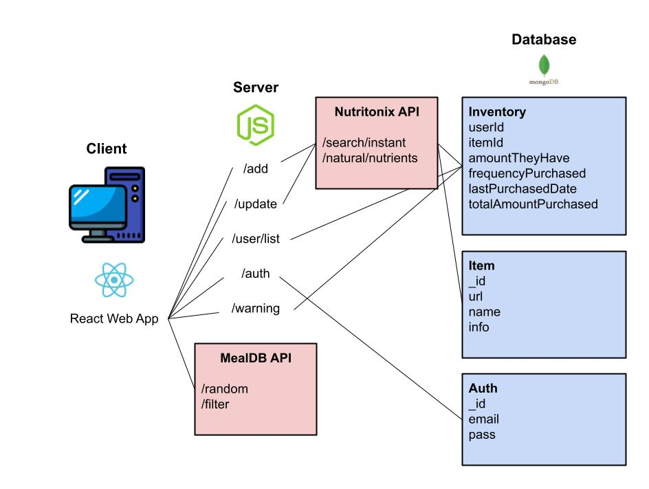

# INFO 441 - Foodie's Home
Peijie Zheng, Marina Wooden, Luna Liu, Chloe Hu

# Project Description
We developed our application with college and university students, as well as young professionals who live on their own and are new to buying groceries. This demographic is busy with school or work, which makes it hard to manage what they have in their fridge. They want to avoid wasting food and money by keeping track of their inventory grocery list.  Users who are health-conscious also benefit from this application, as they can make sure they are not consuming spoiled food that could make them sick.  We offer a user-friendly platform for students and young professionals to easily monitor their groceries, save time and money, and maintain a healthy lifestyle.
  
As we grow independent and take up everyday chores as adults, we realize how much effort actually goes into these seemingly small things. Grocery management is a part of this. It is a heavy task to remember all the ingredients in your pantry, use them meaningfully, and replenish your supply when necessary. Our application will act as a personal butler and help our users run their kitchen by keeping track of inventory, suggesting recipes to consume them, and generating suggested grocery lists.
  
Our main goal is to provide a tool for users to effectively monitor their grocery items. This can help them reduce food waste and carefully plan out their meals. Additionally, it will help users develop a healthy eating habit, especially for college students who are often busy with academics/jobs. Overall, we as developers believe that building this application will greatly benefit users like college students and other groups with food tracking.
  

# Technical Description

| Priority      | User | Description     | Technical implementation  |
| :---          |:----:   |          ---: |           ---:            |
| P0       | As a user       | I need to manage the groceries I just bought.    |     Create an inventory collection that allows the user to add grocery items with a specified amount. The server will fetch these items' images and nutrition from an API and display the information                    |
| P0   | As a user        | I need to keep track of the groceries I just consumed.      |   User can modify their inventory collection to update the amount they have for each grocery item.                         |
| P0   | As a user        | I need to keep track of the food I eat or throw away.      |   User can delete specific grocery items once they consumed all of them and remove them from the user's inventory collection.                         |
| P1   | As a user        | I don't always have time to look through the fridge, but I want to benefit from notifications that tell me what’s gone bad and when.    |    Run a database trigger every day that checks if the date in the expirationDate field is about to be reached. If so, display a warning next to that item.                       |
| P1   | As a user        | I want to compile a grocery list for this week.     |    Use calculated user-purchase frequency of each item to generate recommended grocery lists.                       |
| P2   | As a user        | I want to easily find recipes that contain the main ingredient I want to use.     |   Make a fetch call on recipe APIs with a main ingredient parameter that the user inputs and display the results back to them. Along with each recipe will also return a descriptive and video instruction displayed to the user.                       |

## Endpoints
1. POST /items/add - adds an items to a user’s fridge
2. POST /items/update - for items that have multiple servings, updating how much is left
3. POST /items/delete - for items that have been consumed/thrown away.
4. GET /items/warning - displays a warning for users when items are about to expire
5. POST /users/register - first-time users sign up their account
7. POST/users/login - users logging in
8. POST /users/logout - users logging out
9. (fetch call to external APIs) GET /recipes - returns all recipes and their details. Ingredient specified via query parameters
  

## Appendix

**MongoDB:**  
Auth {  
 &nbsp;&nbsp;&nbsp;&nbsp; “_id”: String,  
 &nbsp;&nbsp;&nbsp;&nbsp; “password”: String,  
 &nbsp;&nbsp;&nbsp;&nbsp; “email”: String  
}

Inventory {  
 &nbsp;&nbsp;&nbsp;&nbsp; “userId”: String,  
 &nbsp;&nbsp;&nbsp;&nbsp; “itemId” String,  
 &nbsp;&nbsp;&nbsp;&nbsp; “amountTheyHave”: String,  
 &nbsp;&nbsp;&nbsp;&nbsp; “frequencyPurchased”: Double,  
 &nbsp;&nbsp;&nbsp;&nbsp; “lastPurchasedDate”: Date,  
 &nbsp;&nbsp;&nbsp;&nbsp; “totalAmountPurchased”: Integer  
}

Items {  
 &nbsp;&nbsp;&nbsp;&nbsp; “_id”: String,  
 &nbsp;&nbsp;&nbsp;&nbsp; "imageURL" String,  
 &nbsp;&nbsp;&nbsp;&nbsp; “name”: String,  
 &nbsp;&nbsp;&nbsp;&nbsp; “info” : {  
         &nbsp;&nbsp;&nbsp;&nbsp;  &nbsp;&nbsp;&nbsp;&nbsp; “nutrition”: String,  
         &nbsp;&nbsp;&nbsp;&nbsp;  &nbsp;&nbsp;&nbsp;&nbsp; “AverageExpirationDate”: Date  
&nbsp;&nbsp;&nbsp;&nbsp; }  
}

